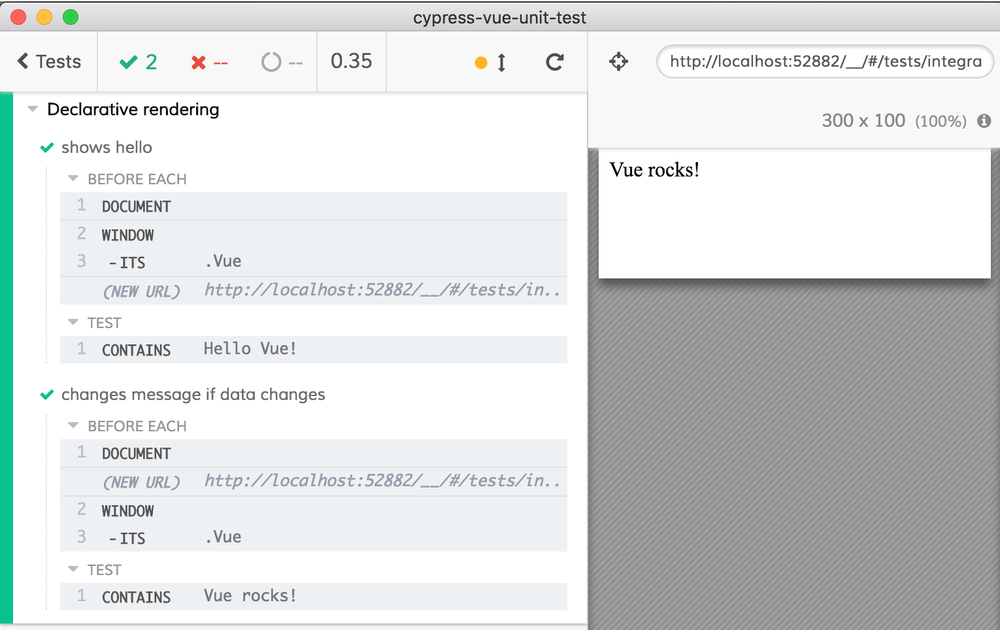
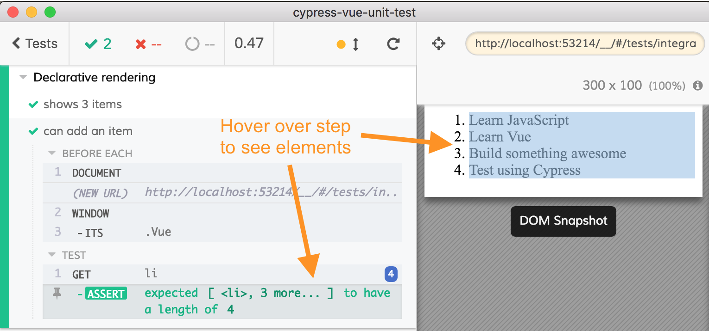
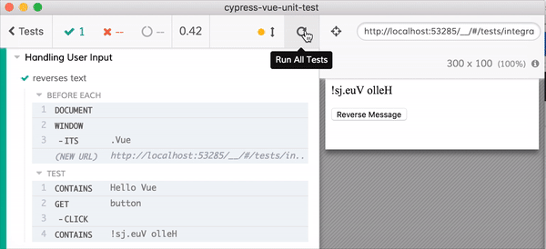
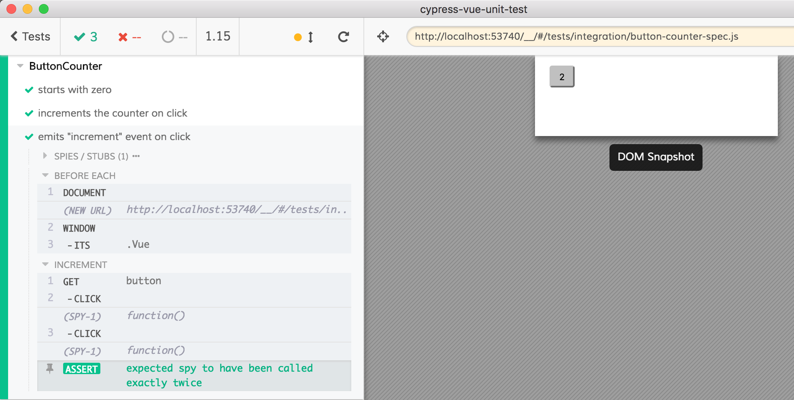
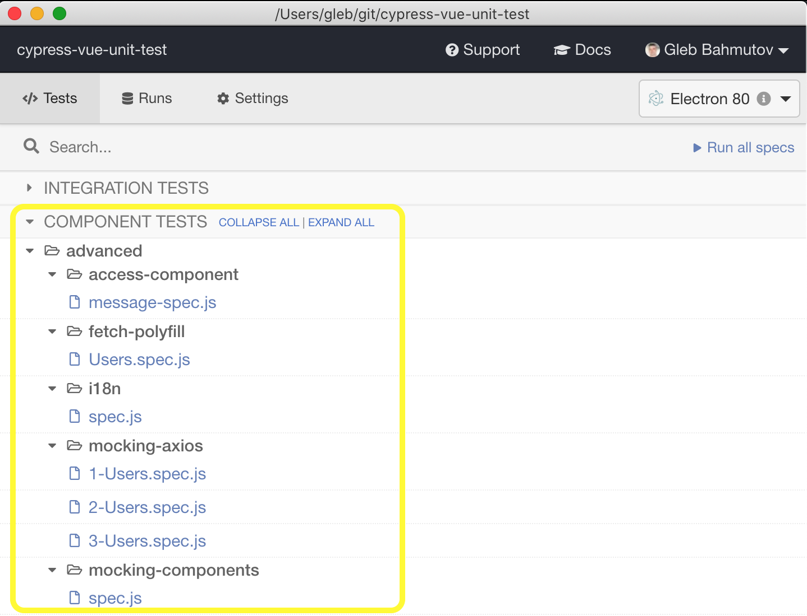

# @cypress/vue

[![NPM][npm-icon] ][npm-url]

[![Build status][ci-image] ][ci-url]
[![Cypress dashboard][cypress-badge] ][cypress-dashboard]
[![semantic-release][semantic-image] ][semantic-url]
[![renovate-app badge][renovate-badge]][renovate-app]

> Browser-based Component Testing for Vue.js with the Open-Source [Cypress.io](https://www.cypress.io/) Test Runner ✌️🌲

**Jump to:** [Comparison](#comparison), [Blog posts](#blog-posts), Examples: [basic](#basic-examples), [advanced](#advanced-examples), [full](#full-examples), [external](#external-examples), [Code coverage](#code-coverage), [Development](#development)

**🚧 Notice** We are in the middle of moving into the Cypress NPM org, so any references to `cypress-vue-unit-test` should be switched to `@cypress/vue`. Once complete, this repository will be archived.

### What is @cypress/vue?
This package allows you to use the [Cypress](https://www.cypress.io/) test runner to mount and test your components within Cypress. It is built on top of the [Vue Test Utils](https://github.com/vuejs/vue-test-utils) package.


### How is this different from Vue Test Utils?
It uses [Vue Test Utils](https://github.com/vuejs/vue-test-utils) under the hood. This is more of a replacement for node-based testing than it is replacing Vue Test Utils and its API. Instead of running your tests in node (using Jest or Mocha), the Cypress Component Testing Library runs each component in the **real browser** with full power of the Cypress Framework: [live GUI, full API, screen recording, CI support, cross-platform](https://www.cypress.io/features/). One benefit to using Cypress instead of a node-based runner is that limitations of Vue Test Utils in Node (e.g. manually awaiting Vue's internal event loop) are hidden from the user due to Cypress's retry-ability logic.  

- If you like using `@testing-library/vue`, you can use `@testing-library/cypress` for the same `findBy`, `queryBy` commands, see one of the examples in the list below

## Installation

<p align="center">
  
</p>

- Requires Cypress v4.5.0 or later
- Requires [Node](https://nodejs.org/en/) version 8 or above
- Only supporting webpack-based projects
- Installation via Vue CLI recommended, read [Write Your First Vue Component Test](https://glebbahmutov.com/blog/first-vue-component-test/)

### Vue CLI Installation

> Vue CLI v3+

_Recommended_: One step install to existing projects with Vue CLI via [experimental plugin](https://github.com/jessicasachs/vue-cli-plugin-cypress-experimental), read [Write Your First Vue Component Test](https://glebbahmutov.com/blog/first-vue-component-test/)

```sh
vue add cypress-experimental
```

If you want to install this package manually, follow [manual install](./docs/manual-install.md)

## Usage and Examples

```js
// components/HelloWorld.spec.js
import { mount } from '@cypress/vue'
import { HelloWorld } from './HelloWorld.vue'
describe('HelloWorld component', () => {
  it('works', () => {
    mount(HelloWorld)
    // now use standard Cypress commands
    cy.contains('Hello World!').should('be.visible')
  })
})
```

### Options

You can pass additional styles, css files and external stylesheets to load, see [docs/styles.md](./docs/styles.md) for full list.

```js
import Todo from './Todo.vue'
const todo = {
  id: '123',
  title: 'Write more tests',
}

mount(Todo, {
  propsData: { todo },
  stylesheets: [
    'https://cdnjs.cloudflare.com/ajax/libs/bulma/0.7.2/css/bulma.css',
  ],
})
```

See examples below for details.

<a name="global-vue-extensions"/>

### Global Vue Options

You can pass extensions (global components, mixins, modules to use)
when mounting Vue component. Use `{ extensions: { ... }}` object inside
the `options`.

- `components` - object of 'id' and components to register globally, see [Components](cypress/component/basic/components) example
- `use` (alias `plugins`) - list of plugins, see [Plugins](cypress/component/basic/plugins)
- `mixin` (alias `mixins`) - list of global mixins, see [Mixins](cypress/component/basic/mixins) example
- `filters` - hash of global filters, see [Filters](cypress/component/basic/filters) example

<a name="intro-example"/>

### The intro example

Take a look at the first Vue v2 example:
[Declarative Rendering](https://vuejs.org/v2/guide/#Declarative-Rendering).
The code is pretty simple

```html
<div id="app">
  {{ message }}
</div>
```

```js
var app = new Vue({
  el: '#app',
  data() {
    return { message: 'Hello Vue!' }
  },
})
```

It shows the message when running in the browser

```
Hello Vue!
```

Let's test it in [Cypress.io][cypress.io] (for the current version see
[cypress/integration/spec.js](cypress/integration/spec.js)).

```js
import { mountCallback } from '@cypress/vue'

describe('Declarative rendering', () => {
  // Vue code from https://vuejs.org/v2/guide/#Declarative-Rendering
  const template = `
    <div id="app">
      {{ message }}
    </div>
  `

  const data = {
    message: 'Hello Vue!',
  }

  // that's all you need to do
  beforeEach(mountCallback({ template, data }))

  it('shows hello', () => {
    cy.contains('Hello Vue!')
  })

  it('changes message if data changes', () => {
    // mounted Vue instance is available under Cypress.vue
    Cypress.vue.message = 'Vue rocks!'
    cy.contains('Vue rocks!')
  })
})
```

Fire up Cypress test runner and have real browser (Electron, Chrome) load
Vue and mount your test code and be able to interact with the instance through
the reference `Cypress.vue.$data` and via GUI. The full power of the
[Cypress API](https://on.cypress.io/api) is available.



<a name="list-example"/>

### The list example

There is a list example next in the Vue docs.

```html
<div id="app-4">
  <ol>
    <li v-for="todo in todos">
      {{ todo.text }}
    </li>
  </ol>
</div>
```

```js
var app4 = new Vue({
  el: '#app-4',
  data: {
    todos: [
      { text: 'Learn JavaScript' },
      { text: 'Learn Vue' },
      { text: 'Build something awesome' },
    ],
  },
})
```

Let's test it. Simple.

```js
import { mountCallback } from 'cypress-vue-unit-test'

describe('Declarative rendering', () => {
  // List example from https://vuejs.org/v2/guide/#Declarative-Rendering
  const template = `
    <ol>
      <li v-for="todo in todos">
        {{ todo.text }}
      </li>
    </ol>
  `

  function data() {
    return {
      todos: [
        { text: 'Learn JavaScript' },
        { text: 'Learn Vue' },
        { text: 'Build something awesome' },
      ],
    }
  }

  beforeEach(mountCallback({ template, data }))

  it('shows 3 items', () => {
    cy.get('li').should('have.length', 3)
  })

  it('can add an item', () => {
    Cypress.vue.todos.push({ text: 'Test using Cypress' })
    cy.get('li').should('have.length', 4)
  })
})
```



<a name="handling-user-input"/>

### Handling User Input

The next section in the Vue docs starts with [reverse message example](https://vuejs.org/v2/guide/#Handling-User-Input).

```html
<div id="app-5">
  <p>{{ message }}</p>
  <button @click="reverseMessage">Reverse Message</button>
</div>
```

```js
var app5 = new Vue({
  el: '#app-5',
  data: {
    message: 'Hello Vue.js!',
  },
  methods: {
    reverseMessage: function () {
      this.message = this.message.split('').reverse().join('')
    },
  },
})
```

We can write the test the same way

```js
import { mountCallback } from '@cypress/vue'

describe('Handling User Input', () => {
  // Example from https://vuejs.org/v2/guide/#Handling-User-Input
  const template = `
    <div>
      <p>{{ message }}</p>
      <button @click="reverseMessage">Reverse Message</button>
    </div>
  `

  function data() {
    return { message: 'Hello Vue.js!' }
  }

  const methods = {
    reverseMessage: function () {
      this.message = this.message.split('').reverse().join('')
    },
  }

  beforeEach(mountCallback({ template, data, methods }))

  it('reverses text', () => {
    cy.contains('Hello Vue')
    cy.get('button').click()
    cy.contains('!sj.euV olleH')
  })
})
```

Take a look at the video of the test. When you hover over the `CLICK` step
the test runner is showing _before_ and _after_ DOM snapshots. Not only that,
the application is fully functioning, you can interact with the application
because it is really running!



<a name="component-example"/>

### Component example

Let us test a complex example. Let us test a [single file Vue component](https://vuejs.org/v2/guide/single-file-components.html). Here is the [Hello.vue](Hello.vue) file

```vue
<template>
  <p>{{ greeting }} World!</p>
</template>

<script>
export default {
  data() {
    return {
      greeting: 'Hello',
    }
  },
}
</script>

<style scoped>
p {
  font-size: 2em;
  text-align: center;
}
</style>
```

**note** to learn how to load Vue component files in Cypress, see
[Bundling](#bundling) section.

Do you want to interact with the component? Go ahead! Do you want
to have multiple components? No problem!

```js
import Hello from '../../components/Hello.vue'
import { mountCallback } from '@cypress/vue'
describe('Several components', () => {
  const template = `
    <div>
      <hello></hello>
      <hello></hello>
      <hello></hello>
    </div>
  `
  const components = {
    hello: Hello,
  }
  beforeEach(mountCallback({ template, components }))

  it('greets the world 3 times', () => {
    cy.get('p').should('have.length', 3)
  })
})
```

<a name="spying-example"/>

### Spying example

Button counter component is used in several Vue doc examples

```vue
<template>
  <button @click="incrementCounter">{{ counter }}</button>
</template>

<script>
export default {
  data() {
    return {
      counter: 0,
    }
  },

  methods: {
    incrementCounter: function () {
      this.counter += 1
      this.$emit('increment')
    },
  },
}
</script>

<style scoped>
button {
  margin: 5px 10px;
  padding: 5px 10px;
  border-radius: 3px;
}
</style>
```

Let us test it - how do we ensure the event is emitted when the button is clicked?
Simple - let us spy on the event, [spying and stubbing is built into Cypress](https://on.cypress.io/stubs-spies-and-clocks)

```js
import ButtonCounter from '../../components/ButtonCounter.vue'
import { mountCallback } from '@cypress/vue'

describe('ButtonCounter', () => {
  beforeEach(mountCallback(ButtonCounter))

  it('starts with zero', () => {
    cy.contains('button', '0')
  })

  it('increments the counter on click', () => {
    cy.get('button').click().click().click().contains('3')
  })

  it('emits "increment" event on click', () => {
    const spy = cy.spy()
    Cypress.vue.$on('increment', spy)
    cy.get('button')
      .click()
      .click()
      .then(() => {
        expect(spy).to.be.calledTwice
      })
  })
})
```

The component is really updating the counter in response to the click
and is emitting an event.



[cypress.io]: https://www.cypress.io/

<a name="xhr-spying-stubbing"/>

### XHR spying and stubbing

The mount function automatically wraps XMLHttpRequest giving you an ability to intercept XHR requests your component might do. For full documentation see [Network Requests](https://on.cypress.io/network-requests). In this repo see [components/AjaxList.vue](components/AjaxList.vue) and the corresponding tests [cypress/integration/ajax-list-spec.js](cypress/integration/ajax-list-spec.js).

```js
// component use axios to get list of users
created() {
  axios.get(`https://jsonplaceholder.cypress.io/users?_limit=3`)
  .then(response => {
    // JSON responses are automatically parsed.
    this.users = response.data
  })
}
// test can observe, return mock data, delay and a lot more
beforeEach(mountCallback(AjaxList))
it('can inspect real data in XHR', () => {
  cy.server()
  cy.route('/users?_limit=3').as('users')
  cy.wait('@users').its('response.body').should('have.length', 3)
})
it('can display mock XHR response', () => {
  cy.server()
  const users = [{id: 1, name: 'foo'}]
  cy.route('GET', '/users?_limit=3', users).as('users')
  cy.get('li').should('have.length', 1)
    .first().contains('foo')
})
```

<a name="spying-window-alert"/>

### Spying on `window.alert`

Calls to `window.alert` are automatically recorded, but do not show up. Instead you can spy on them, see [AlertMessage.vue](components/AlertMessage.vue) and its test [cypress/integration/alert-spec.js](cypress/integration/alert-spec.js)

## Comparison

<!-- prettier-ignore-start -->
Feature | Vue Test Utils or @testing-library/vue | Cypress + `@cypress/vue`
--- | --- | ---
Test runs in real browser | ❌ | ✅
Uses full mount | ❌ | ✅
Test speed | 🏎 | as fast as the app works in the browser
Test can use additional plugins | maybe | use any [Cypress plugin](https://on.cypress.io/plugins)
Test can interact with component | synthetic limited API | use any [Cypress command](https://on.cypress.io/api)
Test can be debugged | via terminal and Node debugger | use browser DevTools
Built-in time traveling debugger | ❌ | Cypress time traveling debugger
Re-run tests on file or test change | ✅ | ✅
Test output on CI | terminal | terminal, screenshots, videos
Tests can be run in parallel | ✅ | ✅ via [parallelization](https://on.cypress.io/parallelization)
Test against interface | if using `@testing-library/vue` | ✅ and can use `@testing-library/cypress`
Spying and mocking | Jest mocks | Sinon library
Code coverage | ✅ | ✅
<!-- prettier-ignore-end -->

## Examples

```js
// components/HelloWorld.spec.js
import { mount } from '@cypress/vue'
import { HelloWorld } from './HelloWorld.vue'
describe('HelloWorld component', () => {
  it('works', () => {
    mount(HelloWorld)
    // now use standard Cypress commands
    cy.contains('Hello World!').should('be.visible')
  })
})
```

### Basic examples

<!-- prettier-ignore-start -->
Spec | Description
--- | ---
[Components](cypress/component/basic/components) | Registers global components to use
[Filters](cypress/component/basic/filters) | Registering global filters
[Hello](cypress/component/basic/hello) | Testing examples from Vue2 cookbook
[Mixins](cypress/component/basic/mixins) | Registering Vue mixins
[Plugins](cypress/component/basic/plugins) | Loading additional plugins
[Props](cypress/component/basic/props) | Pass props to the component during mount
[Slots](cypress/component/basic/slots) | Passing slots and scopedSlots to the component
[Small examples](cypress/component/basic/small-examples) | A few small examples testing forms, buttons
<!-- prettier-ignore-end -->

### Advanced examples

<!-- prettier-ignore-start -->
Spec | Description
--- | ---
[access-component](cypress/component/advanced/access-component) | Access the mounted component directly from test
[i18n](cypress/component/advanced/i18n) | Testing component that uses [Vue I18n](https://kazupon.github.io/vue-i18n/) plugin
[mocking-axios](cypress/component/advanced/mocking-axios) | Mocking 3rd party CommonJS modules like `axios`
[mocking-fetch](cypress/component/advanced/mocking-fetch) | Mocking `window.fetch` to stub responses and test the UI
[fetch-polyfill](ypress/component/advanced/fetch-polyfill) | Using experimental `fetch` polyfill to spy on / stub those Ajax requests using regular Cypress network methods
[mocking-components](cypress/component/advanced/mocking-components) | Mocking locally registered child components during tests
[mocking-imports](cypress/component/advanced/mocking-imports) | Stub ES6 imports from the tests
[render-functions](cypress/component/advanced/render-functions) | Mounting components with a [render function](https://www.tutorialandexample.com/vue-js-render-functions/)
<!-- prettier-ignore-end -->

### Full examples

We have several subfolders in [examples](examples) folder.

<!-- prettier-ignore-start -->
Folder Name | Description
--- | ---
[cli](examples/cli) | An example app scaffolded using Vue CLI and the component testing added using `vue add cypress-experimental` command.
<!-- prettier-ignore-end -->

### External examples

<!-- prettier-ignore-start -->
Repo | Description
--- | ---
[vue-component-test-example](https://github.com/bahmutov/vue-component-test-example) | Scaffolded Vue CLI v3 project with added component tests, read [Write Your First Vue Component Test](https://glebbahmutov.com/blog/first-vue-component-test/).
<!-- prettier-ignore-end -->

## Known problems

<a name="bundling"/>

## Bundling

How do we load this Vue file into the testing code? Using webpack preprocessor. Note that this module ships with [@cypress/webpack-preprocessor](https://github.com/cypress-io/cypress-webpack-preprocessor#compatibility) 2.x that requires Webpack 4.x. If you have Webpack 3.x please add `@cypress/webpack-preprocessor v1.x`.

<a name="short-way"/>

### Short way

#### For Webpack Users

Your project probably already has `webpack.config.js` setup to transpile
`.vue` files. To load these files in the Cypress tests, grab the webpack
processor included in this module, and load it from the `cypress/plugins/index.js`
file.

```js
const {
  onFilePreprocessor,
} = require('@cypress/vue/preprocessor/webpack')
module.exports = (on) => {
  on('file:preprocessor', onFilePreprocessor('../path/to/webpack.config'))
}
```

Cypress should be able to import `.vue` files in the tests

<a name="manual"/>

### Manual

Using [@cypress/webpack-preprocessor](https://github.com/cypress-io/cypress-webpack-preprocessor#readme) and [vue-loader](https://github.com/vuejs/vue-loader).
You can use [cypress/plugins/index.js](cypress/plugins/index.js) to load `.vue` files
using `vue-loader`.

```js
// cypress/plugins/index.js
const webpack = require('@cypress/webpack-preprocessor')
const webpackOptions = {
  module: {
    rules: [
      {
        test: /\.vue$/,
        loader: 'vue-loader',
      },
    ],
  },
}

const options = {
  // send in the options from your webpack.config.js, so it works the same
  // as your app's code
  webpackOptions,
  watchOptions: {},
}

module.exports = (on) => {
  on('file:preprocessor', webpack(options))
}
```

Install dev dependencies

```shell
npm i -D @cypress/webpack-preprocessor \
  vue-loader vue-template-compiler css-loader
```

And write a test

```js
import Hello from '../../components/Hello.vue'
import { mountCallback } from '@cypress/vue'

describe('Hello.vue', () => {
  beforeEach(mountCallback(Hello))

  it('shows hello', () => {
    cy.contains('Hello World!')
  })
})
```

## Code coverage

This plugin uses `babel-plugin-istanbul` to automatically instrument `.js` and `.vue` files and generates the code coverage report using dependency [cypress-io/code-coverage](https://github.com/cypress-io/code-coverage) (included). The output reports are saved in the folder "coverage" at the end of the test run.

If you want to disable code coverage instrumentation and reporting, use `--env coverage=false` or `CYPRESS_coverage=false` or set in your `cypress.json` file

```json
{
  "env": {
    "coverage": false
  }
}
```

**Note ⚠️:** if the component `.vue` file does not have a `<script>` section, it will not have any code coverage information.

<a name="#development"/>

## Development

To see all local tests, install dependencies, build the code and open Cypress in GUI mode

```sh
npm install
npm run build
```

The build is done using `tsc` that transpiles all files from [src](src) to the `dist` folder. You can then run component tests by opening Cypress

```sh
npm run cy:open
```

and clicking on any component spec



Larger tests that use full application and run on CI (see [circle.yml](circle.yml)) are located in the folder [examples](examples).

### Debugging

Run Cypress with environment variable

```
DEBUG=@cypress/vue
```

If some deeply nested objects are abbreviated and do not print fully, set the maximum logging depth

```
DEBUG=@cypress/vue DEBUG_DEPTH=10
```

<a name="#faq"/>

## FAQ

- If your component's static assets are not loading, you probably need
  to start and proxy Webpack dev server. See [issue #4](https://github.com/bahmutov/cypress-vue-unit-test/issues/4)

<a name="#related"/>

## Related info

- [Testing Vue web applications with Vuex data store & REST backend](https://www.cypress.io/blog/2017/11/28/testing-vue-web-application-with-vuex-data-store-and-rest-backend/)
- [Why Cypress?](https://on.cypress.io/why-cypress)
- [Cypress API](https://on.cypress.io/api)
- [Learn TDD in Vue](https://learntdd.in/vue)
- [@cypress/vue vs vue-test-utils](https://codingitwrong.com/2018/03/04/comparing-vue-component-testing-tools.html)

## Migration guide

### From v2 to v3

- update `cypress/plugins/index.js` file to pass the `on, config` arguments when creating the default preprocessor. See [change](https://github.com/bahmutov/cypress-vue-unit-test/pull/331/files#diff-4bcea4966f5e62ded90298c2b0907445), in general the new way is:

```js
const {
  onFileDefaultPreprocessor,
} = require('@cypress/vue/preprocessor/webpack')

module.exports = (on, config) => {
  require('@cypress/code-coverage/task')(on, config)
  on('file:preprocessor', onFileDefaultPreprocessor(config))

  // IMPORTANT to return the config object
  // with the any changed environment variables
  return config
}
```

## Blog posts

- [Write Your First Vue Component Test](https://glebbahmutov.com/blog/first-vue-component-test/)

<a name="#other"/>

## Test adapters for other frameworks

- [cypress-react-unit-test](https://github.com/bahmutov/cypress-react-unit-test)
- [cypress-cycle-unit-test](https://github.com/bahmutov/cypress-cycle-unit-test)
- [cypress-svelte-unit-test](https://github.com/bahmutov/cypress-svelte-unit-test)
- [cypress-angular-unit-test](https://github.com/bahmutov/cypress-angular-unit-test)
- [cypress-hyperapp-unit-test](https://github.com/bahmutov/cypress-hyperapp-unit-test)
- [cypress-angularjs-unit-test](https://github.com/bahmutov/cypress-angularjs-unit-test)

<a name="#maintainers"/>

## Maintainers

The Cypress.io Component Testing Team

- [Jessica Sachs](https://github.com/jessicasachs) (Current Maintainer, [Vue Test Utils](https://github.com/vuejs/vue-test-utils) Maintainer)
- [Gleb Bahmutov](https://github.com/bahmutov) (Original Author, Current Maintainer of [@cypress/react](https://github.com/bahmutov/cypress-react-unit-test))

Support: if you find any problems with this module, [tweet](https://twitter.com/_jessicasachs) / [open issue](https://github.com/cypress-io/cypress/issues) on Github

## License

[](https://github.com/cypress-io/cypress/blob/master/LICENSE)

This project is licensed under the terms of the [MIT license](/LICENSE).

## Badges

Let the world know your project is using Cypress.io to test with this cool badge

[](https://www.cypress.io/)

[npm-icon]: https://nodei.co/npm/@cypress/vue.svg?downloads=true
[npm-url]: https://npmjs.org/package/@cypress/vue
[ci-image]: https://circleci.com/gh/bahmutov/cypress-vue-unit-test/tree/master.svg?style=svg
[ci-url]: https://circleci.com/gh/bahmutov/cypress-vue-unit-test/tree/master
[semantic-image]: https://img.shields.io/badge/%20%20%F0%9F%93%A6%F0%9F%9A%80-semantic--release-e10079.svg
[semantic-url]: https://github.com/semantic-release/semantic-release
[cypress-badge]: https://img.shields.io/badge/cypress.io-tests-green.svg?style=flat-square
[cypress-dashboard]: https://dashboard.cypress.io/#/projects/134ej7
[renovate-badge]: https://img.shields.io/badge/renovate-app-blue.svg
[renovate-app]: https://renovateapp.com/
